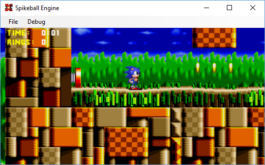

# spikeball
2D Platform game engine written in straight C# which features Sonic the Hedgehog style gameplay.

Spikeball is a small game engine written with the initial aim of emulating the Sonic the Hedgehog series.

<b>Features</b>
<ul>
	<li>Built in emulation the Sonic the Hedgehog movement phyiscs (as described on Sonic Retro).</li>
	<li>Completely standalone C# assembly, with no dependencies on any specific game development tool.</li>
	<li>Portable code, would be possible to port to phone apps for example.</li>
	<li>Game engine and rendering systems are completely decoupled (e.g. possible to use high res sprites).</li>
	<li>Levels/maps built using the Tiled tile editor.</li>
	<li>Collision system (traces + AABB).</li>
	<li>Basic animation system.</li>
	<li>Basic audio system.</li>
	<li>Resource management system (preload/late load).</li>
	<li>Renderer provided which uses Direct2D.</li>
</ul>

<h2>Notes</h2>

The project currently consists of a single Visual Studio 2015 solution and two projects, Platformer.DirectX and Platformer.Engine.
The "DirectX" project a renderer that uses Direct2D to perform its drawing and is the project you need to run as it provides
the actual entry point, the engine is loaded as an assembly.

There are two test maps provided, to "play" them simply choose them from the file menu and use the arrow keys to move
Sonic and the Z key to jump.

Pressing P will toggle pause mode, pressing Q whilst paused will run the game frame-by-frame which was a useful debugging tool.

The engine is a single C# assembly however I have contained the game speciific entities in the "Gameplay" namespace as
the plan may be to eventually split the game away from the engine proper.

The renderer uses the BASS audio library which has seperate builds for x86/x64, therefore the solution can be built
in either x86 or x64, however the engine library does not care which architecture it runs under and is therefore an AnyCPU build.

<h2>Licensing and use of the engine</h2>

If you are inspired to build a full game with this engine as a base then PLEASE DO!! It's free for all and if you have
an idea let me know and I will lively endeavour to support you. There are no royalties required and everytihng falls under
the MIT licence. Libraries I have referenced (such as BASS) which are licenced by other means are easily replaced.

